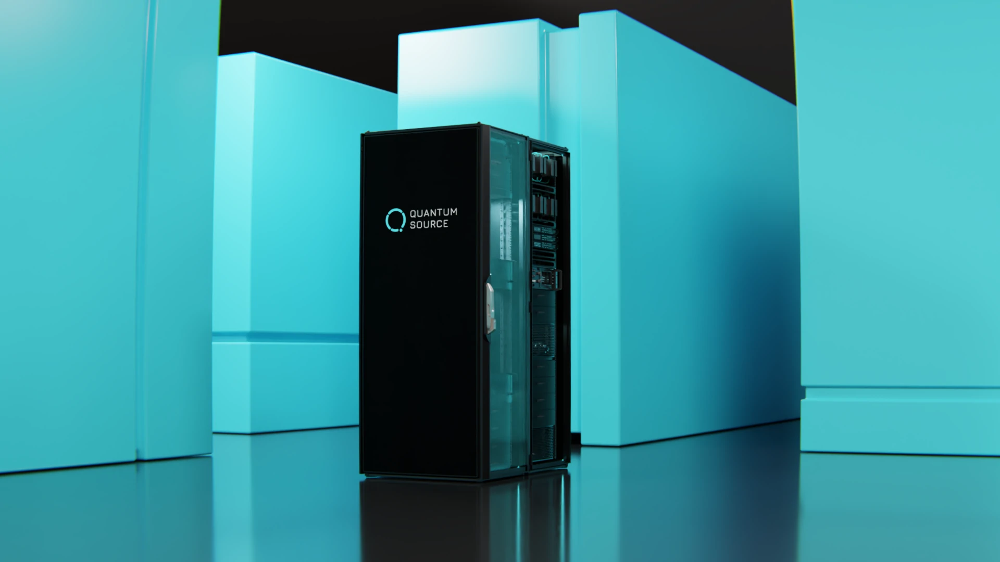

# Origin Interactive Experience

An interactive web application showcasing Quantum Source's revolutionary photonic quantum computing technology through an immersive visual experience.



## 🚀 Project Overview

This is a state-driven web application that simulates exploring a quantum computing laboratory. Users navigate through different views using pre-rendered animations and static images, creating the illusion of 3D navigation while maintaining high performance across all devices.

### Key Features
- **State Machine Navigation**: Smooth transitions between different views of the quantum computer
- **Responsive Design**: Optimized layouts for desktop, tablet, and mobile devices
- **Aspect Ratio Based Layouts**: Smart breakpoints that adapt to any screen proportion
- **Pre-rendered Animations**: WebM videos for smooth transitions without 3D rendering overhead
- **Accessibility**: Semantic HTML and ARIA labels for screen readers

## 🛠 Technical Stack

- **HTML5**: Semantic structure
- **CSS3**: Responsive design with aspect-ratio media queries
- **Vanilla JavaScript**: State management and animation control
- **Web Assets**: WebP images and WebM videos for optimal performance
- **No Dependencies**: Pure web technologies, no frameworks required

## 📁 Project Structure

```
origin-interactive/
├── index.html              # Main HTML structure
├── style.css               # All styling and responsive layouts
├── script.js               # State machine and interaction logic
├── README.md               # This file
├── vercel.json             # Deployment configuration
├── assets/
│   ├── images/            # Static state images (WebP format)
│   │   ├── state1.webp
│   │   ├── state2.webp
│   │   ├── state3.webp
│   │   ├── state4.webp
│   │   └── qr.png
│   ├── animations/        # Transition videos (WebM format)
│   │   ├── seq1.webm
│   │   ├── seq1_reverse.webm
│   │   ├── seq2.webm
│   │   ├── seq2_reverse.webm
│   │   ├── seq3.webm
│   │   ├── seq3_reverse.webm
│   │   ├── seq4.webm
│   │   └── seq4_reverse.webm
│   ├── sound/            # Audio effects
│   │   └── buttonSFX.wav
│   ├── ui-icons/         # Navigation and interface icons
│   │   ├── nav-bar/
│   │   │   ├── building-2.svg
│   │   │   ├── cavity-QED2.svg
│   │   │   ├── cog.svg
│   │   │   ├── cpu.svg
│   │   │   ├── house.svg
│   │   │   └── monitor-cog.svg
│   │   └── [various UI icons].svg
│   └── brand/            # Branding assets
└── docs/                 # Documentation
    ├── webflow.html      # Webflow integration guide
    └── style.css         # Documentation styling
```

## 🎯 How It Works

### State Machine

The application uses a state machine pattern where each "view" is a numbered state:

```javascript
const states = {
    1: { // Overview state
        title: "Introduction to Modestly Sized Quantum Computers",
        descriptions: [...],
        image: "assets/images/state1.webp"
    },
    2: { // System state
        // ...
    }
    // etc.
};
```

### Transitions

Transitions between states use pre-rendered video animations:
- **Sequential animations**: Use `seq1.webm`, `seq2.webm`, etc. for forward transitions
- **Reverse animations**: Use `seq1_reverse.webm`, `seq2_reverse.webm`, etc. for backward transitions
- **Fallback**: Instant image swap if animation unavailable

### Responsive Layouts

The app uses **aspect ratio** to determine the optimal layout:

1. **Portrait Mode** (height > width)
   - Top navigation bar
   - Visual content below nav
   - Text content below visual
   - Dynamic positioning via JavaScript

2. **Wide Landscape** (aspect-ratio > 3:2 AND width > 900px)
   - 3-column layout: Nav (12%) | Content (35%) | Visual (53%)
   - Side navigation with icons
   - Content strip in middle
   - Visual on right side

3. **Narrow Landscape** (between portrait and wide landscape)
   - Same as portrait mode but horizontal
   - Prevents cramped 3-column layout on small screens

## 🔧 Development Guide

### Adding a New State

1. **Add state definition** in `script.js`:
```javascript
const states = {
    // ... existing states
    5: {
        title: "New State Title",
        descriptions: [
            "First paragraph",
            "Second paragraph with <span class='highlight'>highlights</span>"
        ],
        image: "assets/images/state5.webp"
    }
};
```

2. **Add required assets**:
   - Static image: `assets/images/state5.webp`
   - Transition animations: `seq5.webm` and `seq5_reverse.webm`

3. **Update animations mapping**:
```javascript
const animations = {
    // ... existing animations
    "seq5": "assets/animations/seq5.webm",
    "seq5_reverse": "assets/animations/seq5_reverse.webm"
};
```

4. **Add navigation button** (if needed) in `index.html`

### Modifying Layouts

All responsive breakpoints are in `style.css` using aspect-ratio media queries:

```css
/* Portrait: taller than wide */
@media (max-aspect-ratio: 1/1) { }

/* Wide landscape: wide enough for 3 columns */
@media (min-aspect-ratio: 3/2) and (min-width: 900px) { }

/* Narrow landscape: everything else */
@media (min-aspect-ratio: 1/1) and (max-aspect-ratio: 3/2) { }
```

### Asset Guidelines

- **Images**: WebP format, 1920x1080 recommended
- **Videos**: WebM with VP9 codec, 2-3 second duration
- **Audio**: WAV or MP3, under 100KB
- **File naming**: Use consistent `seqX.webm` and `seqX_reverse.webm` pattern for transitions

## 🚀 Deployment

The app is static and can be deployed to any web server:

1. **Vercel** (recommended):
   ```bash
   vercel
   ```

2. **GitHub Pages**:
   - Push to repository
   - Enable Pages in settings

3. **Any Static Host**:
   - Upload all files maintaining folder structure
   - Ensure proper MIME types for WebM videos

### Performance Optimization

- Enable gzip/brotli compression
- Set long cache headers for assets:
  ```
  Cache-Control: public, max-age=31536000
  ```
- Use CDN for global distribution

## 🐛 Troubleshooting

### Common Issues

**Animations not playing:**
- Check browser WebM support
- Verify file paths (case-sensitive on some servers)
- Check console for 404 errors

**Layout issues on specific devices:**
- Use browser DevTools responsive mode
- Check aspect ratio calculations
- Verify media query breakpoints

**Text positioning problems in portrait mode:**
- The `adjustPortraitLayout()` function positions text dynamically
- Check if images are fully loaded before positioning
- Look for JavaScript errors in console

### Browser Support

- **Full support**: Chrome 70+, Firefox 65+, Safari 12+, Edge 79+
- **Fallbacks**: Older browsers get static images without transitions
- **Mobile**: iOS Safari 12+, Chrome Android

## 📝 Code Style

- Use semantic HTML elements
- CSS variables for consistent theming
- Descriptive function and variable names
- Comment complex logic
- Test on real devices, not just DevTools

## 🤝 Contributing

When contributing:
1. Test all responsive breakpoints
2. Ensure animations are smooth
3. Verify accessibility with screen readers
4. Keep file sizes optimized
5. Update this README if adding features

## 📞 Support

For questions about the implementation:
1. Check browser console for errors
2. Verify all assets are loading
3. Test in multiple browsers
4. Review the responsive breakpoints

---

Built with ❤️ for Quantum Source - Making quantum computing accessible to everyone.